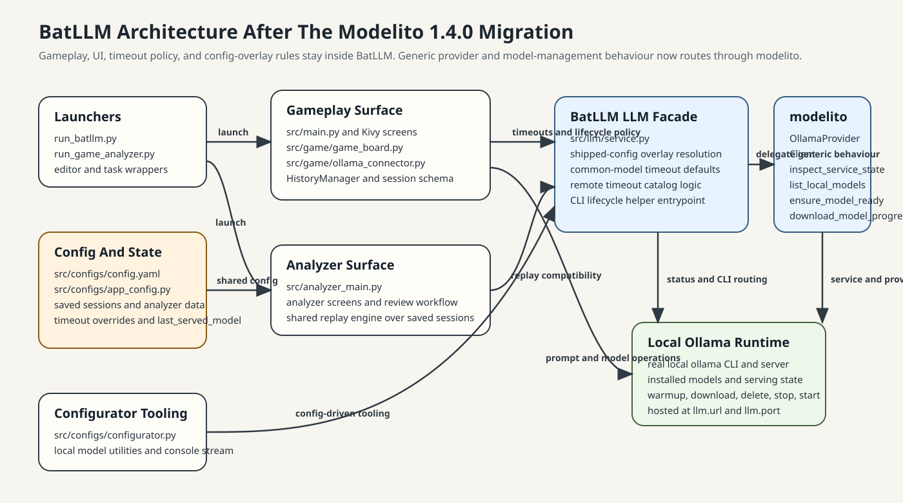
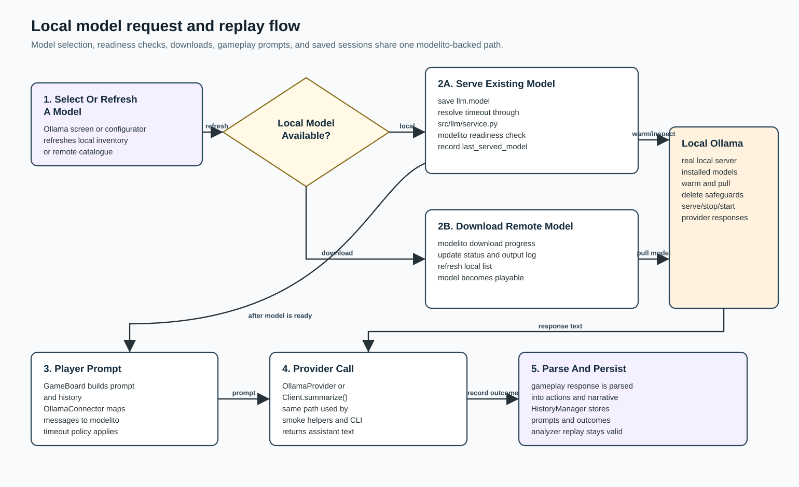

# BatLLM Status

Last updated: 2026-05-06 22:15

## Current State

BatLLM is currently at repository version `0.3.3` and remains centered on two maintained Python/Kivy surfaces:

- the main BatLLM gameplay application
- the read-only Game Analyzer for replay and review workflows

The repository now routes maintained Ollama lifecycle/model-management behavior through `modelito 1.4.0`, with high-priority features for structured model readiness results and configurable service warmup timeout.

## Current Focus

- Upgraded BatLLM to `modelito 1.4.0` with high-priority feature integration.
- Implemented `ensure_model_ready_detailed()` for structured lifecycle feedback.
- Added `warmup_timeout` parameter support through service layer.
- Keep the maintained docs aligned with the enhanced `modelito 1.4.0` architecture.

## Architecture Notes

- Launchers: `run_batllm.py`, `run_game_analyzer.py`
- Main app entrypoint: `src/main.py`
- Gameplay and LLM request orchestration: `src/game/`, `src/llm/`
- Ollama/runtime service surface: `src/llm/service.py`
- UI/runtime model management: `src/view/ollama_config_screen.py`
- Config tooling: `src/configs/configurator.py`
- Tests: `src/tests/`

## Architecture Diagram

## Runtime Flow Diagram

## Recent Changes In This Work Session

- Upgraded `modelito` dependency from `1.2.2` to `1.4.0` in `requirements.txt`.
- Implemented high-priority features from modelito 1.4.0:
  - **Structured readiness results**: Migrated from `ensure_model_ready()` (boolean) to `ensure_model_ready_detailed()` returning `ReadinessResult` with `success`, `phase`, `message`, `source`, `elapsed_seconds`, and `error` fields.
  - **Configurable warmup timeout**: Added `warmup_timeout` parameter (default 30.0s) to `start_service()` call to allow customization of server startup timeout.
  - **Error envelope support**: Imported `ErrorEnvelope`, `ResponseEnvelope`, `TransportPolicy` from modelito for improved error normalization.
- Updated `src/view/ollama_config_screen.py`:
  - Changed `_ensure_model_serving_via_modelito()` and `_ensure_model_serving()` to use `ensure_model_ready_detailed()`.
  - Enriched lifecycle logging with `elapsed_seconds`, `phase`, and `source` information from the result object.
  - Simplified error handling by checking `result.success` and accessing structured error/message fields.
- Updated `src/llm/service.py`:
  - Modified `start_service()` signature to accept `warmup_timeout: float = 30.0` parameter.
  - Added error envelope imports for future error handling improvements.
  - Passed `warmup_timeout` through to modelito's `start_service()` call.
- Updated `docs/CHANGELOG.md` with modelito 1.4.0 upgrade notes.

## Validation

Completed in this work session:

- Upgraded `modelito` from `1.2.2` to `1.4.0` in requirements.txt.
- Updated `src/llm/service.py` with warmup_timeout parameter and error envelope imports.
- Updated both `_ensure_model_serving_via_modelito()` and `_ensure_model_serving()` methods to use `ensure_model_ready_detailed()`.
- Python syntax validation with py_compile pending after this session.
- Pytest validation pending after this session.

Not yet completed in this work session:

- Running pytest suite to validate ensure_model_ready_detailed() integration
- Broader full-suite pytest validation
- Packaging or release-flow validation
- Doxygen/code-doc regeneration for `docs/code/`

## Known Risks And Gaps

- `src/llm/service.py` still owns BatLLM-specific config overlay and timeout policy; that module should stay narrow and should not grow back into a generic Ollama abstraction layer.
- Kivy/UI behavior around model-management flows needs regression coverage whenever service helpers or model lifecycle logic changes.
- Generated `docs/code/` output still reflects older code snapshots until Doxygen is rerun.

## Next Prioritized Steps

1. Run broader full-suite pytest coverage and any packaging-sensitive validation needed for release confidence.
2. Regenerate `docs/code/` if the generated API docs are expected to ship with this refactor.
3. Evaluate whether `src/llm/service.py` startup orchestration should further collapse to direct `modelito.start_service/stop_service` calls in all code paths.

## Longer-term Steps and Decisions

1. GUI: webapp surface? Yes/no? If Yes: in addition to or instead of Kivy?
2. LAN multiplayer
3. Internet multiplayer
4. Library / repo / examples of prompts
5. Computer-controlled player (flavours: prompted, AI-directly, programatically)

Last updated: 2026-05-06 22:15