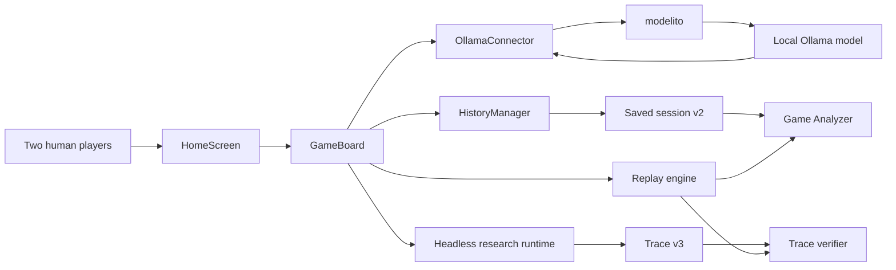

# BatLLM status

Last updated: 2026-07-24 18:51

## Summary

BatLLM is a local, two-player, AI-mediated battle game and a research/education project. Two human players prompt two model-backed bots; the bots act inside a deterministic game world through a small command language.

The current repository version is `0.3.6`. The core game, saved-session workflow, Game Analyzer, local Ollama integration, cross-platform launchers, Homebrew formula generation, and URUCON research artefact are implemented. `main` is protected by multiplatform, dependency, and research checks.

The project is in a stable `0.x` hardening phase rather than a feature-complete 1.0 release. The remaining release work is primarily manual first-run validation, interface consistency, and packaging confidence on native platforms.

## Current capabilities

### Game

- Two human players control two bots by writing prompts.
- A session can contain multiple games; games contain rounds; rounds contain turns.
- Each round uses one prompt per player.
- Commands cover movement, clockwise and anticlockwise rotation, shield control, and firing.
- Independent-context and shared-context modes are supported.
- Prompt augmentation can prepend structured game state.
- Each new game starts with a fresh model conversation history.
- Long-running model calls execute away from the Kivy UI thread.
- Game and round lifecycle callbacks are guarded against stale asynchronous completion.

### History and saved sessions

- `HistoryManager` is the authoritative record of games, rounds, turns, prompts, responses, commands, states, and outcomes.
- User-facing exports use the validated BatLLM session-v2 envelope.
- Saved rounds include frozen gameplay settings; sessions include model/runtime metadata.
- Only completed turns are exported. Active and cancelled zero-play turns are omitted.
- Writes are atomic and save failures are reported to the user.

### Game Analyzer

- Available from the main application and through `python run_game_analyzer.py`.
- Loads one validated v2 session at a time.
- Supports game, round, turn-start, and individual-play navigation.
- Replays commands through the pure transition engine using saved rules.
- Shows prompts, raw model responses, parsed commands, state differences, settings, and model metadata.
- Rejects legacy list exports and malformed sessions rather than approximating them.

### Ollama and model management

- Gameplay requests and model-management helpers are routed through `modelito==1.4.5`.
- The application can open the official Ollama installer and manage the configured local service.
- Local models can be selected, warmed, and deleted.
- Remote catalogue entries can be downloaded into the local model inventory.
- Global, per-model, and startup warm-up timeouts are supported.
- Destructive and expensive actions use confirmation flows where implemented.

### Research runtime

- The graphical application retains the v2 session format for user compatibility.
- The URUCON research runtime records schema-v3 traces through headless entry points.
- Verification covers trace structure, application-level invocation evidence, response-to-command grounding, and operative replay.
- The implementation-owned research artefact, schema, corpus, results, and claim ledger remain in this repository.
- The editable manuscript is maintained separately in `krahd/academic-writing`.

## Supported environment

| Area | Current support |
| --- | --- |
| Python | `3.10`, `3.11`, and `3.12`; `3.12` recommended |
| Desktop platforms | macOS, Linux, Windows |
| Model runtime | local Ollama through `modelito` |
| Homebrew | source-based Apple Silicon macOS formula |
| User session format | v2 |
| Research trace format | v3 |
| Licence | MIT |

## Run and validate

### Install from source

```bash
python3 -m venv .venv_BatLLM
source .venv_BatLLM/bin/activate
python -m pip install -r requirements.txt
```

On Windows PowerShell, activate with `.\.venv_BatLLM\Scripts\Activate.ps1`.

### Launch

```bash
python run_batllm.py
python run_game_analyzer.py
```

### Test

```bash
python run_tests.py core
python run_tests.py non-live
python tools/check_docs.py
```

`python run_tests.py full` additionally starts and stops the configured real Ollama service. Run it only with explicit maintainer intent.

## Architecture



The most important separation is between Kivy presentation and deterministic state transitions. `replay_engine.py` provides command parsing and state transition logic without requiring the graphical interface; the analyzer and research verifier reuse this logic.

## Configuration and mutable state

- `src/configs/config.yaml` is the shipped configuration and is mutable when running directly from a source checkout without `BATLLM_HOME`.
- When `BATLLM_HOME` is set, mutable configuration is written to `$BATLLM_HOME/config.yaml` and relative saved-session folders resolve below that directory.
- Homebrew wrappers set `BATLLM_HOME` to `~/Library/Application Support/BatLLM` by default.
- Release-bundle launchers currently keep state relative to the extracted bundle unless the user sets `BATLLM_HOME`.
- Tests establish a temporary `BATLLM_HOME` before importing the application configuration.

See `docs/STATE_AND_INSTALLATION.md` for the maintained reference.

## Important files

- `README.md`: project overview and installation.
- `docs/README.md`: documentation index.
- `docs/USER_GUIDE.md`: game and application manual.
- `docs/CONTRIBUTING.md`: development, architecture, validation, and release work.
- `docs/CHANGELOG.md`: chronological history.
- `AGENTS.md`: operating rules for coding agents.
- `VERSION` and `CITATION.cff`: version and citation metadata.
- `run_batllm.py`, `run_game_analyzer.py`, `run_tests.py`: primary entry points.
- `src/game/`: game, history, replay, session, and research logic.
- `src/view/`: Kivy screens and layouts.
- `src/llm/service.py`: Ollama/modelito lifecycle facade.
- `research/urucon2026/`: reproducibility artefact.
- `.github/workflows/`: CI, dependency, packaging, research, and release workflows.

## Recent durable changes

- Closed asynchronous game-reset, fatal-shot, and retired-callback races.
- Isolated model conversation history across every game transition.
- Made session export retain only analyzer-valid completed turns.
- Strengthened nested session and replay-state validation, including bot identity consistency.
- Preserved rejected prompts and reported session-save errors without exiting.
- Isolated tests from repository and user configuration.
- Restored complete multiplatform non-live CI and focused URUCON reproducibility validation.
- Moved manuscript ownership to `academic-writing` while retaining implementation evidence here.
- Reorganised documentation around a root project README, a documentation index, a current status snapshot, and role-specific manuals.
- Removed obsolete audit-bundle payloads and one-off PR helper files from the maintained tree.

Historical detail belongs in `docs/CHANGELOG.md`, pull requests, and the research audit files rather than in this status page.

## Validation state

Latest validated application baseline from PR #46:

- complete non-live suite: `189 passed, 2 skipped`;
- full Pylint gate: passed;
- Python compilation: passed;
- `git diff --check`: passed;
- complete URUCON research experiment pipeline: passed;
- Dependency review: passed;
- Python dependency audit: passed;
- Multiplatform Validation: passed;
- URUCON research validation: passed.

Documentation audit validation on PR #47:

- documentation structure, local Markdown links, and local HTML links: passed;
- complete non-live suite: passed;
- full Pylint gate: passed;
- Python compilation and `git diff --check`: passed;
- Dependency review and Python dependency audit: passed;
- Multiplatform Validation, including release bundles, Homebrew dry-run, and mock-Ollama smoke testing: passed;
- URUCON research validation and reproducibility package build: passed;
- stale command, state-path, workflow, packaging, and research-CI claims corrected.

## Known limitations and risks

- The desktop UI still requires manual spot checks on a machine with a display.
- Live Ollama validation can start, stop, warm, download, or delete real local resources and is not safe to run casually.
- Native first-run checks for Linux and Windows release bundles remain maintainer-owned release tasks.
- Homebrew support is source-based and currently oriented towards Apple Silicon macOS.
- Release bundles do not yet set a platform user-state directory automatically.
- The graphical application supports saved-session v2 only; legacy exports are intentionally unsupported.
- Doxygen output under `docs/code/` is large and noisy and should be regenerated only intentionally.
- Some Kivy-bound coordination remains in `GameBoard`; further separation is desirable before networked play.

## Pending work

### Before a 1.0 release candidate

1. Run manual gameplay and analyzer smoke checks on macOS, Linux, and Windows.
2. Complete first-run checks with Ollama missing, installed-but-stopped, and already running.
3. Validate each native release-bundle launcher and writable-state behaviour.
4. Run live Ollama tests only on a machine where service mutation is acceptable.
5. Run install-level Homebrew validation on Apple Silicon macOS.
6. Complete the remaining UI consistency and accessibility work recorded in `docs/UI_UNIFICATION_PLAN_1_0.md`.
7. Review the draft 1.0 release criteria and sign off explicitly.

### Longer term

- Continue moving deterministic game/session logic out of Kivy-bound coordination.
- Design the server contract before implementing networked or web clients.
- Preserve replay determinism and schema versioning through the 2.0 architecture change.
- Treat shared prompt or game repositories as later work requiring authentication, moderation, provenance, and versioning.

Last updated: 2026-07-24 18:51
