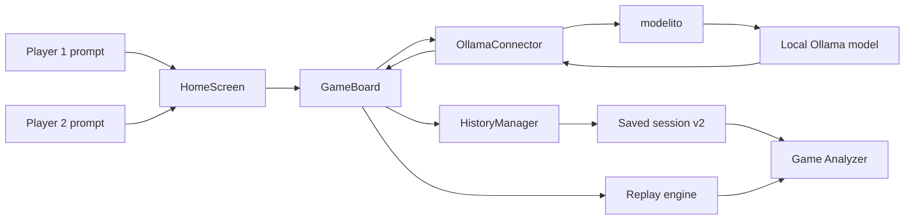

>  **[Project](../README.md) · [Documentation](README.md) · [User Guide](USER_GUIDE.md) · [FAQ](FAQ.md) · [Contributing](CONTRIBUTING.md) · [Status](../STATUS.md) · [Releases](https://github.com/krahd/BatLLM/releases)**

# Contributing

BatLLM is a Python/Kivy game, a research artefact, and an educational project. Contributions should preserve all three roles: the application must remain usable, the recorded data must remain interpretable, and changes should not obscure the project's critical framing around AI mediation and literacy.

## Contribution principles

- Keep pull requests focused on one coherent change.
- Preserve current behaviour unless the change explicitly intends to alter it.
- Add or update tests when behaviour changes.
- Update the relevant documentation in the same pull request.
- Consider macOS, Linux, and Windows when changing paths, launchers, dependencies, or subprocesses.
- Keep destructive or expensive Ollama operations explicit and confirmed.
- Do not let tests write to a user's configuration or real saved sessions.
- Use British English in maintained prose documentation.

For larger features or architecture changes, open an issue before implementation.

## Development setup

### Python

BatLLM supports Python `3.10`, `3.11`, and `3.12`. Python `3.12` is recommended.

macOS and Linux:

```bash
git clone https://github.com/krahd/BatLLM.git
cd BatLLM
python3 -m venv .venv_BatLLM
source .venv_BatLLM/bin/activate
python -m pip install --upgrade pip
python -m pip install -r requirements.txt
```

Windows PowerShell:

```powershell
git clone https://github.com/krahd/BatLLM.git
cd BatLLM
py -m venv .venv_BatLLM
.\.venv_BatLLM\Scripts\Activate.ps1
python -m pip install --upgrade pip
python -m pip install -r requirements.txt
```

### Launchers

Main application:

```bash
python run_batllm.py
```

Standalone Game Analyzer:

```bash
python run_game_analyzer.py
```

The repository also contains `scripts/cmr-r`, a small Unix convenience launcher that selects the project virtual environment when available.

### Ollama

Most tests do not require Ollama. Live gameplay and the explicitly live test mode require:

- the `ollama` CLI;
- a reachable local Ollama service; and
- at least one installed model.

BatLLM uses `modelito` for gameplay requests and model-management helpers. The repository-supported version is pinned in `requirements.txt`; contributors should install the complete requirements file rather than installing individual packages manually.

## Repository structure

| Path | Purpose |
| --- | --- |
| `run_batllm.py` | main desktop launcher |
| `run_game_analyzer.py` | standalone analyser launcher |
| `run_tests.py` | cross-platform `core`, `non-live`, and `full` test runner |
| `src/main.py` | main Kivy application shell and startup/shutdown flow |
| `src/view/` | screen controllers and KV layouts |
| `src/game/game_board.py` | live game, round, and turn coordination |
| `src/game/bot.py` | bot state and command execution |
| `src/game/bullet.py` | bullet travel and collision behaviour |
| `src/game/ollama_connector.py` | model request construction and conversation histories |
| `src/game/history_manager.py` | authoritative session, game, round, turn, and chat history |
| `src/game/replay_engine.py` | Kivy-free command parsing and deterministic transition logic |
| `src/game/session_schema.py` | user-facing saved-session v2 validation |
| `src/game/session_v3.py` | research trace-v3 structures |
| `src/analyzer_model.py` | analyser navigation and replay model |
| `src/llm/service.py` | BatLLM-specific Ollama/modelito lifecycle facade |
| `src/configs/` | shipped defaults, alternate profiles, and config loader |
| `src/util/paths.py` | repository, asset, user-state, and saved-session path resolution |
| `src/tests/` | automated tests and smoke helpers |
| `research/urucon2026/` | research runtime, schema, experiments, corpus, results, and artefact |
| `create_release_bundles.py` | cross-platform release archive generator |
| `create_homebrew_formula.py` | Homebrew formula generator |
| `validate_packaging_smoke.py` | release-bundle and Homebrew validation |

## Runtime architecture



### Live game flow

1. `HomeScreen` collects one prompt per player.
2. `GameBoard` starts the round when both prompts are ready.
3. `OllamaConnector` builds the model messages and maintains independent or shared histories.
4. `modelito` sends the request to Ollama.
5. `replay_engine.parse_model_response()` converts the returned text into BatLLM's bounded command grammar.
6. The live bot executes the command.
7. `HistoryManager` records prompts, responses, commands, states, and outcomes.

Each new game receives a fresh connector history. This prevents late responses from a retired game contaminating the next game's model context.

### Saved sessions and analysis

The graphical application exports session schema v2. Each saved round includes a frozen gameplay-settings snapshot; the top-level envelope also records model/runtime metadata. Only completed turns are exported.

The Game Analyzer validates the saved file, replays the ordered commands using the frozen rules, and reports state differences rather than silently approximating incompatible data. Legacy top-level list exports are intentionally rejected.

### Research runtime

The URUCON research path is separate from the user-facing v2 export. It records schema-v3 traces through headless entry points and verifies them with the pure transition engine. See [research/urucon2026/README.md](../research/urucon2026/README.md).

The editable paper is not stored in this repository.

## Configuration and mutable state

The shipped defaults are in `src/configs/config.yaml`. `src/configs/app_config.py` overlays hard-coded fallback values, the shipped YAML, and an optional user YAML.

The active location depends on how BatLLM is launched:

- **Source checkout without `BATLLM_HOME`:** configuration changes write to `src/configs/config.yaml`; relative saved-session folders resolve inside the repository.
- **`BATLLM_HOME` set:** mutable configuration writes to `$BATLLM_HOME/config.yaml`; relative saved-session folders resolve below `$BATLLM_HOME`.
- **Homebrew:** the generated wrappers set `BATLLM_HOME` to `~/Library/Application Support/BatLLM` unless the user overrides it.
- **Release bundles:** the launchers currently run from the extracted bundle and do not set `BATLLM_HOME`; state therefore remains relative to that extracted directory unless the user sets the variable.
- **Tests:** `src/tests/conftest.py` sets an isolated temporary `BATLLM_HOME` before application configuration is imported.

See [STATE_AND_INSTALLATION.md](STATE_AND_INSTALLATION.md) for the compact reference.

### Main configuration groups

| Section | Important keys |
| --- | --- |
| `game` | rounds, turns, health, damage, dimensions, movement, context mode, prompt augmentation |
| `ui` | frame rate, exit behaviour, Ollama startup/shutdown behaviour, title and presentation defaults |
| `llm` | model, endpoint, request options, prompt files, timeouts, last served model |
| `data` | saved-session folder |

Do not copy the full YAML into prose documentation. Link to the shipped file and document only behaviour that readers need; this reduces configuration drift.

## Testing

### Core smoke

```bash
python run_tests.py core
```

This runs the small history/configuration smoke module.

### Complete non-live suite

```bash
python run_tests.py non-live
```

`non-live` is the default mode, so this is equivalent:

```bash
python run_tests.py
```

Direct pytest invocation is also supported:

```bash
python -m pytest -q src/tests
```

The non-live suite is the normal validation path for gameplay, UI logic, analysis, path handling, packaging helpers, and research contracts.

### Live Ollama suite

```bash
python run_tests.py full
```

This command starts the configured Ollama service, runs the suite with live smoke enabled, and then stops the service.

> [!WARNING]
> Use `full` only when it is acceptable for BatLLM to start and stop the real configured Ollama service.

### Headless Kivy environment

CI uses:

```bash
export KIVY_WINDOW=mock
export KIVY_NO_ARGS=1
export KIVY_NO_CONSOLELOG=1
export PYTHONPATH=src
```

Tests already set an isolated `BATLLM_HOME`; do not point tests at user state.

### Lint and compilation

```bash
python -m compileall -q src run_batllm.py run_game_analyzer.py run_tests.py \
  create_release_bundles.py create_homebrew_formula.py validate_packaging_smoke.py

python -m pylint src run_batllm.py run_game_analyzer.py \
  create_release_bundles.py create_homebrew_formula.py
```

The maintained Pylint gate is configured in `.pylintrc` and CI.

### Documentation checks

```bash
python tools/check_docs.py
```

This checks required documentation, local Markdown and HTML links, the `STATUS.md` timestamp contract, repository-version references, and the absence of known temporary audit artefacts.

Regenerate Doxygen output only when the public API documentation intentionally changes:

```bash
doxygen docs/code/dox_config.properties
```

Review generated changes carefully; `docs/code/` is large and noisy.

### Packaging checks

Release bundles and formula rendering:

```bash
python validate_packaging_smoke.py
```

Homebrew-specific unit checks:

```bash
python create_homebrew_formula.py \
  --create-worktree-archive /tmp/BatLLM-homebrew-source.tar.gz \
  --formula-out /tmp/batllm.rb
python -m pytest -q src/tests/test_homebrew_packaging.py
```

Optional install-level modes mutate the current machine and should be run deliberately:

```bash
python validate_packaging_smoke.py --run-installer-smoke
python validate_packaging_smoke.py --run-homebrew-install-smoke
```

## Continuous integration

Current pull requests to `main` are covered by:

- **CI:** the complete non-live suite on Python `3.10`–`3.12` across Ubuntu, macOS, and Windows; compilation on every matrix job; Pylint on Ubuntu/Python 3.12.
- **Multiplatform Validation:** release-bundle generation on all three operating systems, Homebrew formula/package tests, and a mock-Ollama integration smoke.
- **Python dependency audit:** `pip-audit` against `requirements.txt`.
- **Dependency review:** high-severity dependency-diff review when the repository dependency graph is available.
- **URUCON research validation:** focused research-facing tests, schema validation, experiments, and research-artefact packaging on Ubuntu/Python 3.12 when relevant paths change.

Repository protection may require workflow-level checks rather than every matrix job individually. `docs/RELEASE_CRITERIA_1_0.md` records the current release gate.

## Documentation responsibilities

The documentation has deliberately separated roles:

- `README.md`: public project overview and installation.
- `docs/README.md`: documentation index.
- `docs/USER_GUIDE.md`: game and application use.
- `docs/FAQ.md`: recurring questions.
- `docs/CONTRIBUTING.md`: development and maintenance.
- `STATUS.md`: current snapshot only.
- `docs/CHANGELOG.md`: chronological history.

Update the relevant page whenever a change affects:

- UI labels or navigation;
- game terminology or rules;
- configuration keys, defaults, or state paths;
- model-management behaviour;
- session formats or analyzer compatibility;
- supported Python/platforms;
- test or release commands; or
- repository structure.

Do not append PR-by-PR audit narratives to `STATUS.md`. Record durable current facts there; put historical detail in the changelog, the pull request, or a research audit file whose purpose is explicitly historical.

## Release and distribution work

The repository version is stored in `VERSION` and mirrored in `CITATION.cff` and maintained release-facing documentation.

Build release archives with:

```bash
python create_release_bundles.py
```

The generator creates source, Windows, macOS, and Linux archives under `dist/releases/`.

Generate a Homebrew formula from a release tag with:

```bash
python create_homebrew_formula.py \
  --github-tag v$(cat VERSION) \
  --formula-out /path/to/homebrew-krahd/Formula/batllm.rb
```

Tagged publication to `krahd/homebrew-tap` is handled by `.github/workflows/publish-homebrew-tap.yml` when the repository secret `HOMEBREW_TAP_TOKEN` is configured.

Before a release candidate, use:

- [1.0 release criteria](RELEASE_CRITERIA_1_0.md);
- [first-run and release checklist](FIRST_RUN_RELEASE_CHECKLIST.md); and
- [maintainer audit checklist](MAINTAINER_AUDIT_CHECKLIST.md).

## Troubleshooting

### Imports fail from the repository root

Use the root launchers rather than importing `src` modules directly. The launchers add `src/` to `sys.path` and enforce the supported Python range.

### BatLLM cannot start or reach Ollama

1. Confirm that the `ollama` CLI is installed.
2. Check the host and port in the active configuration.
3. Run `python -m llm.service status` with `PYTHONPATH=src`.
4. Inspect the output log in **Ollama Config**.
5. Verify that the selected model exists locally.

### Gameplay requests time out

Timeout precedence is:

1. `llm.model_timeouts[model]`;
2. `llm.timeout`;
3. built-in common-model defaults; and
4. the generic fallback.

The service warm-up timeout is separate and uses `llm.warmup_timeout`, with a built-in 30-second default.

### A saved session fails validation

Use a current v2 session exported after at least one completed turn. Do not edit saved state manually unless testing validation behaviour. The analyzer rejects legacy list exports and malformed identity/state maps intentionally.

### Remote models do not load

Remote catalogue retrieval requires network access. Local gameplay does not require remote catalogue access once an installed model is available.

### Generated API documentation is stale

Run Doxygen only when the source-level API docs should change, then inspect the generated diff before committing.
