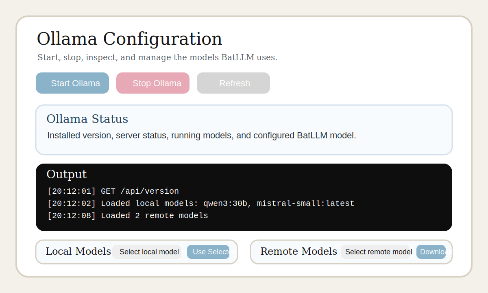
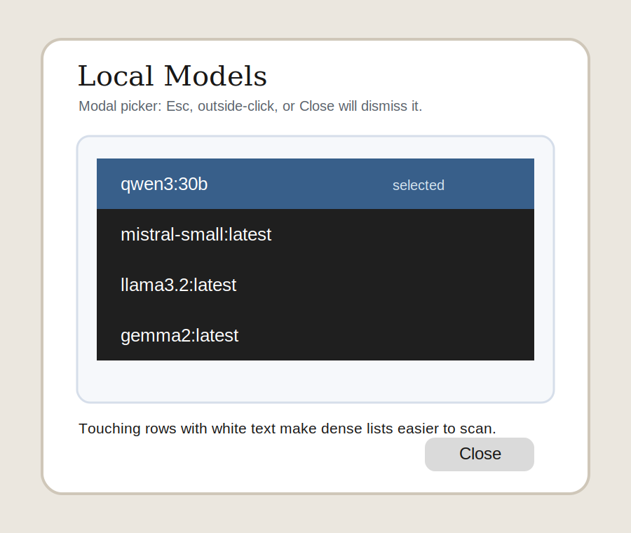
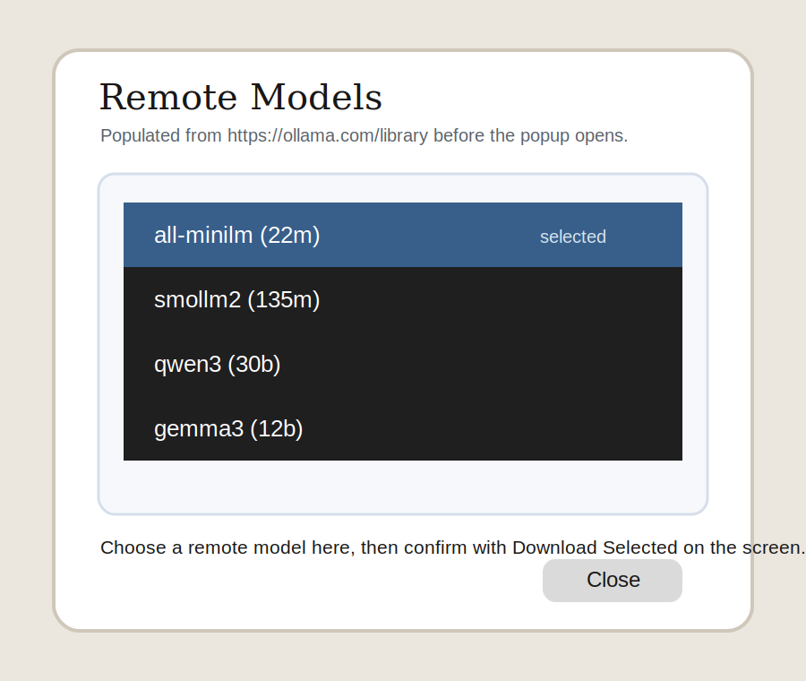

>  **[Overview](DOCUMENTATION.md) · [Readme](README.md) · [User Guide](USER_GUIDE.md) · [Configuration](CONFIGURATION.md) · [Testing](TESTING.md) · [Troubleshooting](TROUBLESHOOTING.md) · [Contributing](CONTRIBUTING.md) · [FAQ](FAQ.md) · [Changelog](CHANGELOG.md) · [Credits](CREDITS.md) · [Code Docs](code/html/index.html)**

# BatLLM

BatLLM is a free and libre local game for learning with LLMs. Two human players write prompts, two model-backed bots interpret those prompts, and the bots fight inside a simple turn-based arena.

The project is intentionally practical: the point is not just to watch an LLM answer text prompts, but to make prompt quality, model behavior, context design, and system configuration materially affect the outcome of play.


## What Is In The App

BatLLM currently ships with:

1. a main gameplay screen for prompt entry and round control
2. a settings screen for gameplay and exit-flow options
3. a history screen for prompt and response review
4. an Ollama configuration screen for local service and model management

## Requirements

### System Requirements

1. Python 3.8 or newer. Python 3.11 or 3.12 is recommended.
2. A local Ollama installation if you want to run BatLLM with the default workflow.
3. Hardware capable of running the local model you choose.

### Python Dependencies

The repository Python environment uses `requirements.txt`, which now includes the packages the current code imports, including `requests` and the Python `ollama` client.

### Ollama Requirements

BatLLM uses both:

- the Python `ollama` package during gameplay
- the `ollama` CLI for the in-app start/stop/version workflow and helper scripts

If the CLI is missing, the app can show install guidance, but it does not install Ollama automatically.

## Quick Start

Clone the repository, create a virtual environment, install the Python dependencies, and launch the app:

```bash
git clone https://github.com/krahd/BatLLM.git
cd BatLLM
python -m venv .venv_BatLLM
source .venv_BatLLM/bin/activate
pip install -r requirements.txt
python src/main.py
```

If the Ollama CLI is not already installed, install it separately. On macOS with Homebrew:

```bash
brew install ollama
```

## Recommended Ollama Workflow

The default operational path is inside the app:

1. launch BatLLM
2. open `Settings`
3. click `Ollama Config`
4. use the Ollama screen to start Ollama, select a local model, and download or delete models as needed

The `Local Models` and `Remote Models` controls open modal pickers. Those pickers:

- refresh their data before opening
- render the model names in white text
- highlight the current selection
- use tightly packed rows with no gap between adjacent model entries
- close on `Esc`
- close when the user clicks outside the popup

Remote models are loaded from `https://ollama.com/library`.

### Local vs Remote Models

- local models already exist in your Ollama installation and can be selected immediately
- remote models are only candidates for download; they are not usable until pulled locally

### What `Use Selected` Does

Choosing a local model and pressing `Use Selected` updates `llm.model` in `src/configs/config.yaml`. BatLLM then attempts to make that model available for gameplay. If BatLLM previously started a different model itself, it may stop that earlier managed model before warming the newly selected one.

## Safety

> [!WARNING]
> BatLLM is provided as-is. The Ollama screen operates on your real local Ollama installation.

> [!CAUTION]
> If other tools use the same Ollama installation, BatLLM can affect them by starting or stopping the server, downloading models, deleting models, or switching the model BatLLM itself uses.

Destructive or expensive actions are guarded by confirmation dialogs where implemented, but the effects are still real:

- `Download Selected` downloads a local Ollama model
- `Delete Selected` deletes a local Ollama model
- `Start Ollama` and `Stop Ollama` control the configured local service

## Screens At A Glance

### Home

The home screen is where players:

- write and submit prompts
- browse prompt history
- load and save prompt text
- start new games
- open settings and history

Pressing `Esc` on the home screen enters the configured exit flow. Depending on the settings, BatLLM may:

- ask for exit confirmation
- ask whether to save the session before exit
- exit immediately

### Settings

The settings screen controls:

- rounds, turns, health, damage, shield size, and step length
- independent vs shared model contexts
- prompt augmentation
- `Confirm on Exit`
- `Prompt to Save on Exit`

The button that opens the Ollama screen is labeled `Ollama Config`.

### History

The history screen shows:

- a compact, per-bot history pane
- a full session history pane

It currently uses an explicit `Back` button to return to the home screen.

### Ollama Config

The Ollama screen shows:

- current Ollama status
- a multi-line output log
- local model controls
- remote model controls

Illustrated references:





## Testing

See [TESTING.md](TESTING.md) for the full testing guide.

Common commands:

```bash
./run_tests.sh core
```

```bash
KIVY_WINDOW=mock KIVY_NO_ARGS=1 KIVY_NO_CONSOLELOG=1 KIVY_HOME=/tmp/batllm-kivy PYTHONPATH=src ./.venv_BatLLM/bin/python -m pytest -q src/tests/test_history_compact.py src/tests/test_close_prompt_behavior.py src/tests/test_utils_confirmation_dialog.py src/tests/test_ollama_config_screen.py src/tests/test_ollama_config_screen_logic.py
```

## More Documentation

- usage and screen-by-screen instructions: [USER_GUIDE.md](USER_GUIDE.md)
- configuration reference: [CONFIGURATION.md](CONFIGURATION.md)
- troubleshooting: [TROUBLESHOOTING.md](TROUBLESHOOTING.md)
- contributor guide: [CONTRIBUTING.md](CONTRIBUTING.md)
- release notes: [CHANGELOG.md](CHANGELOG.md)
