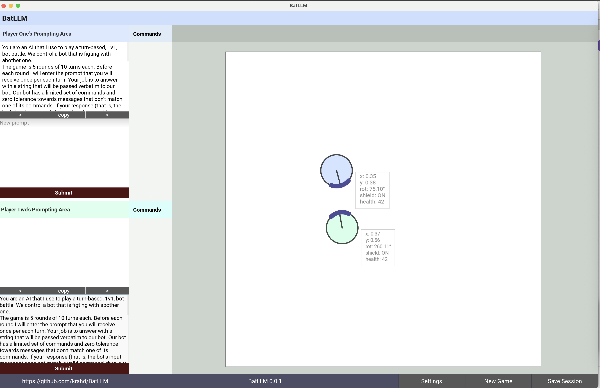

>  **[Readme](README.md) &mdash; [Documentation](DOCUMENTATION.md) &mdash; [User Guide](USER_GUIDE.md) &mdash; [Contributing](CONTRIBUTING.md) &mdash; [FAQ](FAQ.md) &mdash; [Credits](CREDITS.md)**

# BatLLM

**BatLLM** is a _free and libre_ open source research project, education tool, and, at its very core, a game. A simple, human-vs-human, turn-based battle game. The game, however, does not expose any interaction mechanisms to play. Players are required to utilise an AI to play. These AIs (think ChatGPT but running locally) dont know anything about the game. Deploying effective gaming strategies using AI-mediated interaction is the players' task.

Like every other area where AI is used, having the best strategy for the problem space (the game world) alone is not enough to win. By combining language, strategy, and AI-driven gameplay, **BatLLM** hopes to offer a fun, safe, self-directed, independent and hands-on platform to explore and learn about the prowess and shortcomings of LLMs.

_In a world increasingly shaped by AI, and marked by profound asymmetries of power, knowledge, and access, developing critical and practical AI literacy is both urgent and necessary._

The project aims to support a broader social understanding of AI, leveraging intuitive understandings with experiential learning. We hope to contribute to the process of bulding AI prompting skills while highlighting the need for critical engagements with the social, political and economic dynamics that are deeply entrenched in generative AI systems.

This README consistes of this introduction, a very brief introduction to the game, and a minimalistic guide to getting started with the project. To know more about **BatLLM**, its objectives and technical details, please refer to the [project documentation](DOCUMENTATION.md).

> [!IMPORTANT]
> **BatLLM** was developed as part of a project supported by the [2024 Arts & Humanities Grant Program](https://www.colorado.edu/researchinnovation/2024/05/03/seventeen-arts-humanities-projects-receive-grants-advance-scholarship-research-and) of the [Research & Innovation Office](https://www.colorado.edu/researchinnovation/) at the University of Colorado Boulder.
>
> [!WARNING]
> BatLLM is provided as-is, without warranties of any kind. It may change your local Ollama environment, including the active model selection, running server state, and local model inventory.
>
> [!CAUTION]
> If you use Ollama for other projects, be careful with BatLLM's Ollama controls. Starting, stopping, downloading, or deleting models from BatLLM can affect models and services that are also used elsewhere on the same machine.

<!--  -->


## Getting Started

### System Requirements

1. **Python:** 3.8 or higher. Python 3.11 is recommended.
2. **Environment:** While the code should work almost everywhere, development and testing has been done exclusively on a M1 laptop with MacOS 15.5
3. **Hardware:** While BotLLM itself is extremely light, the computer (or another one in the same network) needs to be able able to run locally the LLM models used.

### LLM Models

As of now, **BatLLM** prompts the LLMs via HTTP requests. Everything, especially the GUI, assumes that players and LLMs share a single machine.

**BatLLM** does not care about the local architecture. All it needs is a local endpoint to post queries to. The default and recommended setup path is now through BatLLM itself, using the in-app Ollama Control Screen from Settings.

If Ollama is already installed on your machine, BatLLM can use that existing installation. If it is missing, BatLLM can guide you through the setup flow and then let you choose, download, and manage models from inside the app.

### Installation

To run **BatLLM** on your computer you must download the project and run it using Python. To achieve this you may:

**Clone this repository**, create and activate a Python virtual environment. Install the project requirements using PIP.

```bash
git clone https://github.com/krahd/batllm.git
cd batllm
python -m venv .venv_BatLLM
source .venv_BatLLM/bin/activate
pip install -r requirements.txt
```

**Run BatLLM** using python:

```bash
python src/main.py
```

After BatLLM opens, use **Settings -> Open Ollama Screen** as the default way to:

1. Start or stop Ollama.
2. Refresh and select a local model.
3. Browse downloadable models.
4. Download or delete models with confirmation.

### Manual Ollama Setup (Optional)

Use this only if you prefer to manage Ollama yourself or if Ollama is already installed and you want to keep using your own workflow.

With **[Homebrew](https://formulae.brew.sh/formula/ollama)**, installing Ollama only requires running `brew install ollama`.

You may then start Ollama from the repository root with:

```bash
./start_ollama.sh
```

And stop it with:

```bash
./stop_ollama.sh
```

If you want to install a model yourself, you may use standard Ollama commands such as:

```bash
ollama pull llama3.2:latest
```

> [!CAUTION]
> Manual and in-app Ollama management both operate on the same local Ollama installation. Deleting or replacing a model in BatLLM can remove a model that another project depends on.

## Testing

BatLLM includes a one-command test runner with two modes:

```bash
./run_tests.sh core
```

Runs non-interactive smoke checks only (config integrity, shell script syntax, and Python source compilation).

```bash
./run_tests.sh full
```

Runs the full smoke suite, including live Ollama integration checks. This mode starts Ollama, runs tests, and stops Ollama automatically.

If needed, make the runner executable once:

```bash
chmod +x run_tests.sh
```

## Ollama Control Screen

BatLLM includes an in-app Ollama control interface available from the Settings screen. This is the default workflow for most users.

### Access

1. Start BatLLM.
2. Open **Settings**.
3. Click **Open Ollama Screen**.

### Features

The Ollama screen supports the following actions:

1. **Start Ollama**: Runs the local startup script and attempts to warm the configured model.
2. **Stop Ollama**: Stops running models and stops the Ollama server process.
3. **Choose Local Model**: Refresh and select from locally available models, then save as active `llm.model`.
4. **Download Model**: Refresh remote models and request a download with confirmation.
5. **Delete Model**: Remove a local model with confirmation.

### Missing Ollama Handling

If Ollama cannot be started because it is missing, the screen prompts for a path and shows installation guidance (safe command suggestion flow, no automatic install).

### Safety Notes

1. Download and delete actions require explicit confirmation.
2. Automated tests for these actions use mocks and do not perform real model downloads or deletions.
3. BatLLM's Ollama controls can affect other local projects that use the same Ollama service and model store.
4. Deleting a model from BatLLM deletes the local Ollama model, not just BatLLM's reference to it.

## Disclaimer

BatLLM is offered as-is for research, education, and experimentation. The project makes no guarantee that it will preserve your local Ollama setup, maintain compatibility with all local models, or be suitable for any specific workflow. You are responsible for reviewing changes before downloading, deleting, or reconfiguring models.

## Playing

As before, for a more detailed overview of _the game_, please refer to the [User Guide](USER_GUIDE.md)

### Brutal LLM Bot Battle Pit

An execution of BatLLM's app is called a session. By convention, _Sessions enjoy a 1:1:1 correspondence between Human Players, AI models, and Game Bots_. **Games** are **Rounds** of **Turns** (A _Turn_ consits of two _Plays_; Plays are modelled implictly).

Before each round, players prepare and submit the prompt that will be used for all of their Plays during thhis round. Gameplay is almost entirely devoted to creating, testing, and improving Prompts.

The game supports four different playing modes via two user-controllable flags. One defines whether the players share the prompt context or not . The other one controls whether the user-provided prompts are augmented with a complete and up-todate game state.

The GUI includes some tools for prompt management, game configuration, gameplay control, and provides real–time (although simple) graphic rendering of rounds.

In addition to the gameplay screens, BatLLM now includes an Ollama Control Screen for local model and server management. Because that screen can modify your shared Ollama installation, use it carefully if your machine is also used for other local AI workflows.

### Chat history management

Earlier revisions of BatLLM stored the conversation between each bot and the
LLM in per-bot `chat_history` lists, and maintained an additional
`chat_history_shared` list when both players shared a single context. This
duplicated information and made it difficult to reconstruct a complete
conversation. To simplify the design, **all chat messages are now
recorded centrally by the `HistoryManager`**. Whenever a bot sends a prompt
or receives a response, it calls `HistoryManager.record_message` to store
the message along with its role (``"user"`` or ``"assistant"``) and bot
identifier. At any point the full conversation can be reconstructed using
`HistoryManager.get_chat_history(shared=True)` for the shared context or
`HistoryManager.get_chat_history(bot_id, shared=False)` when each bot
maintains a separate context. As a result, the `Bot` class no longer
defines a `chat_history` attribute.

>  **[Readme](README.md) &mdash; [Documentation](DOCUMENTATION.md) &mdash; [User Guide](USER_GUIDE.md) &mdash; [Contributing](CONTRIBUTING.md) &mdash; [FAQ](FAQ.md) &mdash; [Credits](CREDITS.md)**
