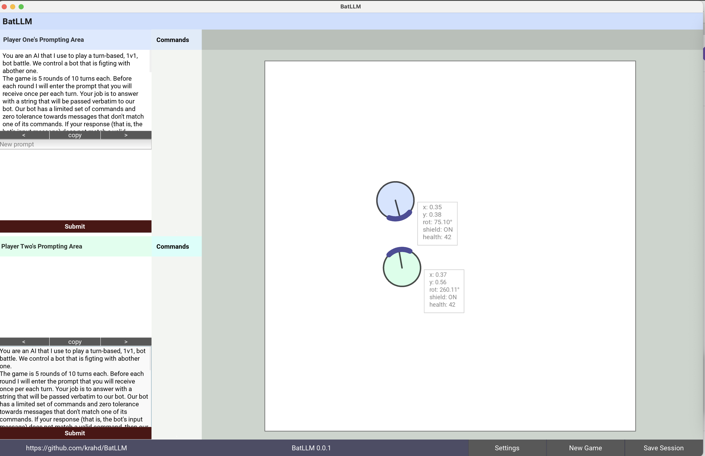

>  **[Readme](README.md) — [Documentation](DOCUMENTATION.md) — [User Guide](USER_GUIDE.md) — [Contributing](CONTRIBUTING.md) — [FAQ](FAQ.md) — [Credits](CREDITS.md)**

# BatLLM

**BatLLM** is a _free and libre_ open source research project, education tool, and, at its very core, a game. A simple, human-vs-human, turn-based battle game. The game, however, does not expose any interaction mechanisms to play. Players are required to utilise an AI to play. These AIs (think ChatGPT but running locally) dont know anything about the game. Deploying effective gaming strategies using AI-mediated interaction is the players' task.

Like every other area where AI is used, having the best strategy for the problem space (the game world) alone is not enough to win. By combining language, strategy, and AI-driven gameplay, **BatLLM** hopes to offer a fun, safe, self-directed, independent and hands-on platform to explore and learn about the prowess and shortcomings of LLMs.

_In a world increasingly shaped by AI, and marked by profound asymmetries of power, knowledge, and access, developing critical and practical AI literacy is both urgent and necessary._

The project aims to support a broader social understanding of AI, leveraging intuitive understandings with experiential learning. We hope to contribute to the process of bulding AI prompting skills while highlighting the need for critical engagements with the social, political and economic dynamics that are deeply entrenched in generative AI systems.

This README consistes of this introduction, a very brief introduction to the game, and a minimalistic guide to getting started with the project. To know more about **BatLLM**, its objectives and technical details, please refer to the [project documentation](DOCUMENTATION.md).

> [!IMPORTANT] > **BatLLM** was developed as part of a project supported by the [2024 Arts & Humanities Grant Program](https://www.colorado.edu/researchinnovation/2024/05/03/seventeen-arts-humanities-projects-receive-grants-advance-scholarship-research-and) of the [Research & Innovation Office](https://www.colorado.edu/researchinnovation/) at the University of Colorado Boulder.

<!--  -->


## Getting Started

### System Requirements

1. **Python:** 3.8 or higher. Python 3.11 is recommended.
2. **Environment:** While the code should work almost everywhere, development and testing has been done exclusively on a M1 laptop with MacOS 15.5
3. **Hardware:** While BotLLM itself is extremely light, the computer (or another one in the same network) needs to be able able to run locally the LLM models used.

### LLM Models

As of now, **BatLLM** prompts the LLMs via HTTP requests. Everything, especially the GUI, assumes that players and LLMs share a single machine.

**BatLLM** does not care about the local architecture. All it needs is a local endpoint to post queries to. The easiest way to set up a running environment fom cratch is using **[Ollama](https://ollama.com/)** to download and run [llama3.2:latest](https://ollama.com/library/llama3.2) on mac computer with an "Apple Silicon" (post Intel) GPU.

With **[Homebrew](https://formulae.brew.sh/formula/ollama)**, installing Ollama only requires running `brew install ollama`. After installing Ollama, you can download the model with `ollama pull llama3.2:latest` (it takes a little bit to download but you only do it once).

You can start and stop the model with `start_ollama.sh` and `stop_ollama.sh` in the project's root.

### Installation

To run **BatLLM** on your computer you must download the project and run it using Python. To achieve this you may:

**Clone this repository**, create and activate a Python virtual environment. Install the project requirements using PIP.

```bash
git clone https://github.com/krahd/batllm.git
cd batllm
python -m venv .venv_BatLLM
source .venv_BatLLM/bin/activate
pip install -o requirements.txt
```

**Start a Llama3.2 instance**

```bash
./start_ollama.sh
```

**Run BatLLM** using python:

```bash
python src/main.py
```

To **stop** the Ollama instance you may run:

```bash
./stop_ollama.sh
```

## Playing

As before, for a more detailed overview of _the game_, please refer to the [User Guide](USER_GUIDE.md)

**Brutal LLM Bot Battle Pit: BatLLM**

An execution of BatLLM's app is called a session. By convention, _Sessions enjoy a 1:1:1 correspondence between Human Players, AI models, and Game Bots_. **Games** are **Rounds** of **Turns** (A _Turn_ consits of two _Plays_; Plays are modelled implictly).

Before each round, players prepare and submit the prompt that will be used for all of their Plays during thhis round. Gameplay is almost entirely devoted to creating, testing, and improving Prompts.

The game supports four different playing modes via two user-controllable flags. One defines whether the players share the prompt context or not . The other one controls whether the user-provided prompts are augmented with a complete and up-todate game state.

The GUI includes some tools for prompt management, game configuration, gameplay control, and provides real–time (although simple) graphic rendering of rounds.

>  **[Readme](README.md) &mdash; [Documentation](DOCUMENTATION.md) &mdash; [User Guide](USER_GUIDE.md) &mdash; [Contributing](CONTRIBUTING.md) &mdash; [FAQ](FAQ.md) &mdash; [Credits](CREDITS.md)**
